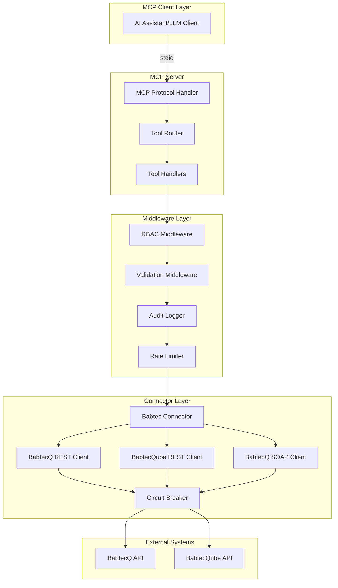
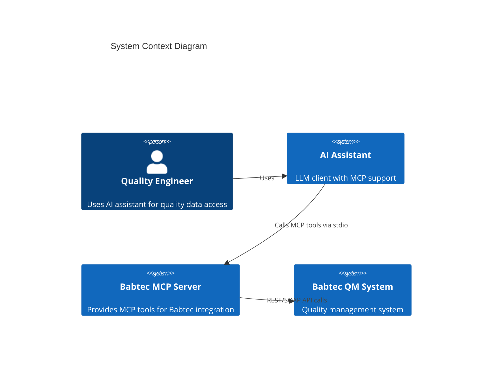
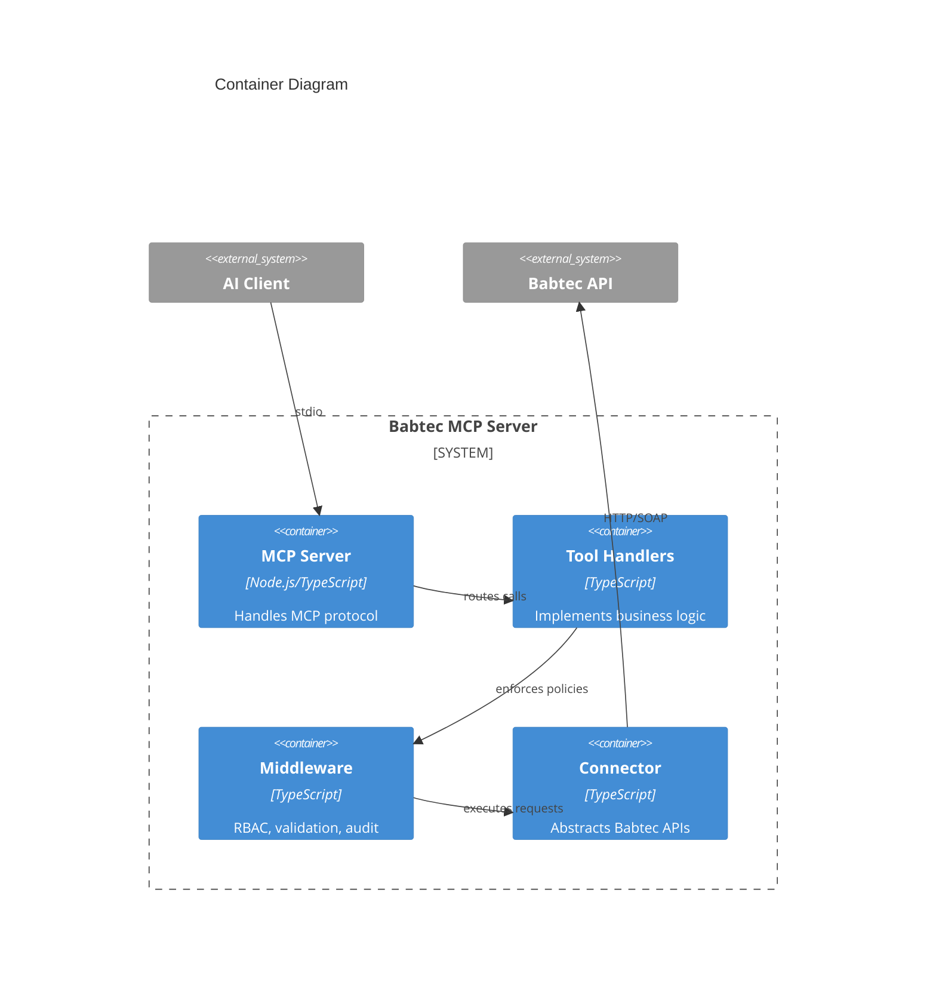
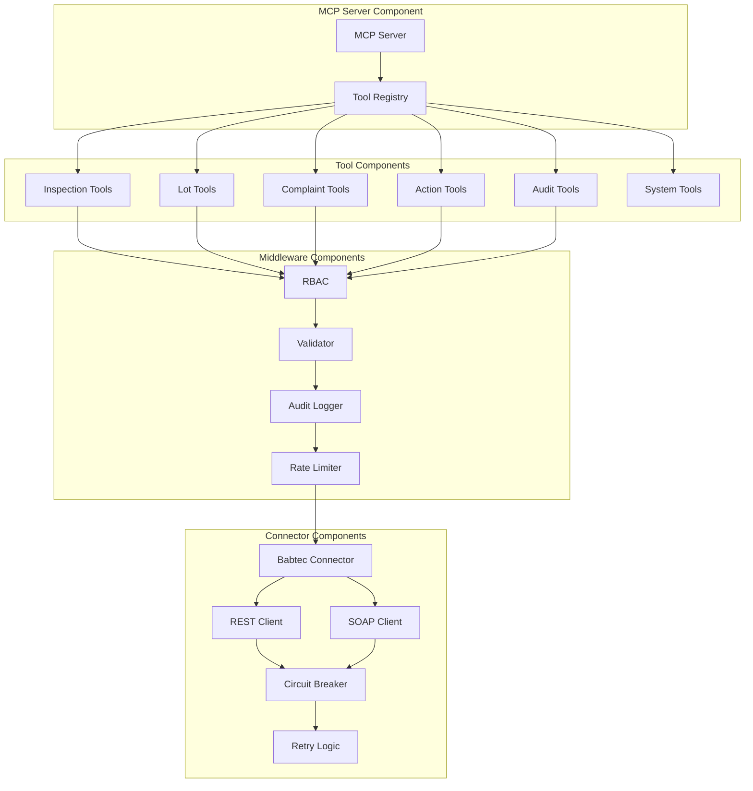
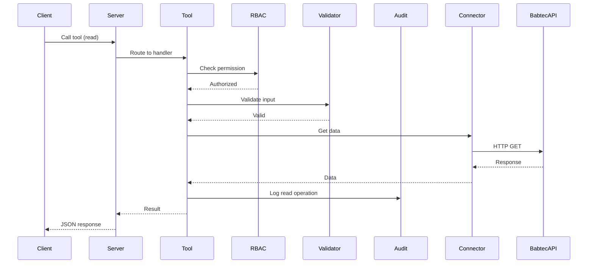
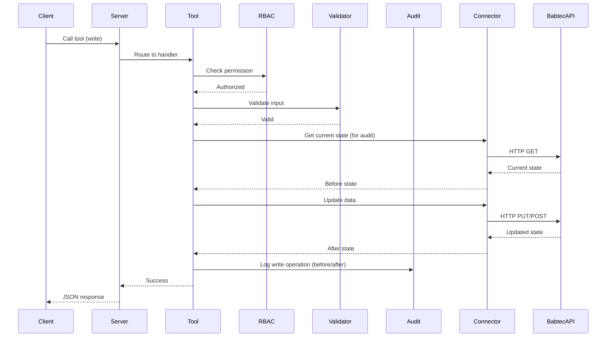
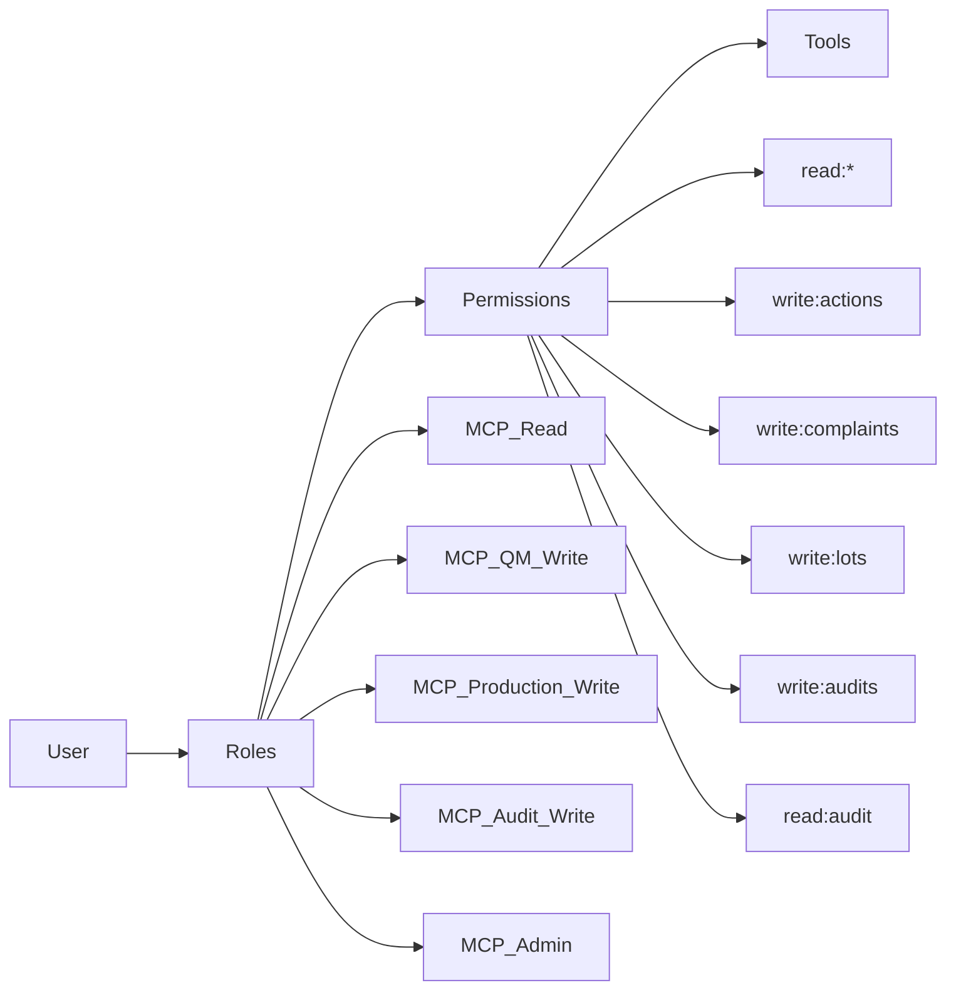
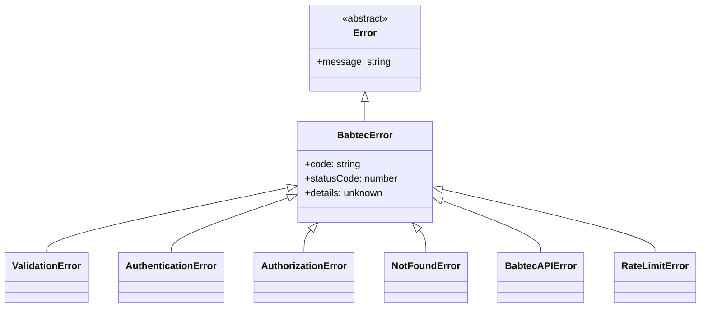
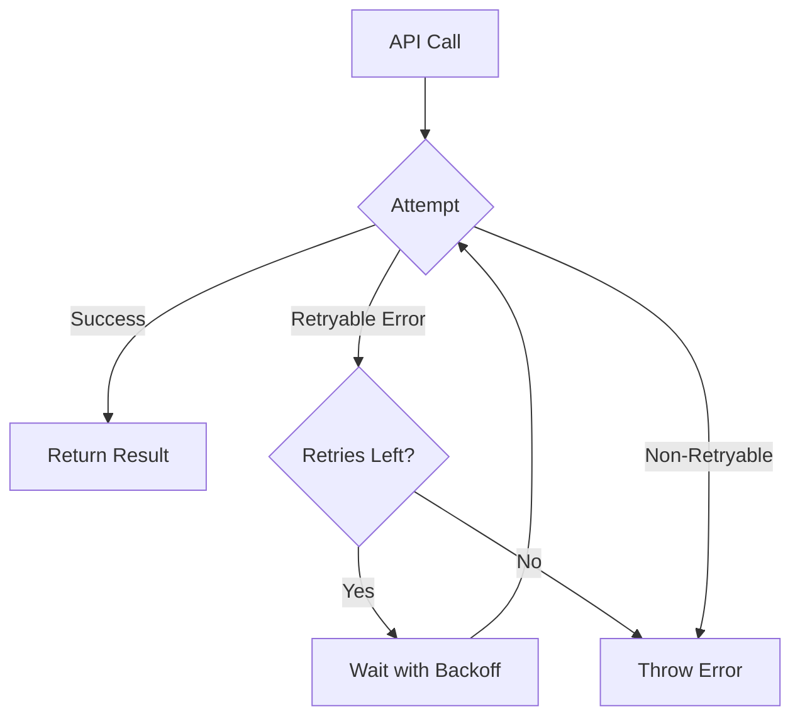

# Babtec MCP Server - Architecture Documentation

**Version:** 1.0.0  
**Last Updated:** 2025-01-27

## Table of Contents

1. [System Overview](#system-overview)
2. [Architecture Diagrams](#architecture-diagrams)
3. [Component Architecture](#component-architecture)
4. [Data Flow](#data-flow)
5. [Security Architecture](#security-architecture)
6. [Error Handling Architecture](#error-handling-architecture)
7. [Performance Considerations](#performance-considerations)
8. [Scalability](#scalability)
9. [Technology Decisions](#technology-decisions)

## System Overview

The Babtec MCP Server is a Model Context Protocol server that provides a standardized interface for AI assistants to interact with Babtec quality management systems.

### High-Level Architecture

## Architecture Diagrams

### System Context

### Container Diagram

### Component Diagram

## Component Architecture

### MCP Server Component

**Responsibilities:**
- Handle MCP protocol communication (stdio)
- Register and manage tools
- Route tool calls to handlers
- Handle errors and format responses

**Key Classes:**
- `BabtecMCPServer`: Main server class
- `ToolHandler`: Tool interface

### Tool Components

**Responsibilities:**
- Implement business logic for each MCP tool
- Validate inputs using Zod schemas
- Call connectors for API operations
- Format responses

**Tool Categories:**
1. **Inspection Plans**: Search and retrieve inspection plans
2. **Inspection Lots**: Search, retrieve, and update lot status
3. **Complaints**: Search, retrieve, and update 8D process
4. **Actions**: Create, update, and close quality actions
5. **Audits**: Create and update audit findings
6. **System**: Health checks and audit log queries

### Middleware Components

**RBAC (Role-Based Access Control):**
- Checks user permissions before tool execution
- Maps roles to permissions
- Throws authorization errors if unauthorized

**Validation:**
- Validates input parameters using Zod schemas
- Provides clear error messages
- Ensures type safety

**Audit Logger:**
- Logs all read and write operations
- Stores logs in JSONL format
- Supports querying for compliance

**Rate Limiter:**
- Limits requests per time window
- Prevents abuse
- Returns rate limit errors when exceeded

### Connector Components

**Babtec Connector:**
- Abstracts multiple Babtec API endpoints
- Handles endpoint selection and fallback
- Manages API version negotiation

**REST Client:**
- Implements REST API calls using axios
- Handles authentication
- Manages request/response transformation

**SOAP Client:**
- Implements SOAP API calls (if needed)
- Handles WS-Security authentication
- Transforms SOAP messages

**Circuit Breaker:**
- Prevents cascading failures
- Opens circuit after failure threshold
- Attempts recovery after timeout

**Retry Logic:**
- Retries failed requests with exponential backoff
- Handles retryable errors
- Limits retry attempts

## Data Flow

### Read Operation Flow

### Write Operation Flow

## Security Architecture

### Authentication

The server authenticates to Babtec APIs using configured credentials:

- **Basic Auth**: Username/password
- **Bearer Token**: JWT or API token
- **API Key**: Key in custom header
- **SOAP WS-Security**: For SOAP endpoints

Credentials are stored in environment variables or configuration files (never in code).

### Authorization

**Role-Based Access Control (RBAC):**

**Permission Model:**
- Permissions are checked at tool entry point
- Wildcard permissions supported (`read:*`, `write:*`)
- Deny by default - explicit permission required

### Audit Trail

All operations are logged for compliance:

- **Read operations**: Logged with user, timestamp, entity type
- **Write operations**: Logged with before/after state
- **Audit logs**: Stored in JSONL format, queryable
- **Retention**: Configurable (default 365 days)

## Error Handling Architecture

### Error Hierarchy

### Error Flow

1. **Tool Level**: Validates input, throws `ValidationError` if invalid
2. **RBAC Level**: Checks permissions, throws `AuthorizationError` if unauthorized
3. **Connector Level**: Handles API errors, throws `BabtecAPIError`
4. **Server Level**: Maps errors to MCP error codes, returns to client

### Retry Strategy

**Retryable Errors:**
- Network timeouts
- 5xx server errors
- Rate limit errors (with retry-after)

**Non-Retryable Errors:**
- 4xx client errors (except rate limits)
- Validation errors
- Authentication errors

## Performance Considerations

### Connection Pooling

HTTP connections are reused via axios connection pooling:
- Reduces connection overhead
- Improves response times
- Limits concurrent connections

### Circuit Breaker

Prevents cascading failures:
- Opens circuit after failure threshold
- Fails fast when circuit is open
- Attempts recovery after timeout

### Rate Limiting

Prevents API abuse:
- Limits requests per time window
- Returns clear error when exceeded
- Protects downstream APIs

### Caching (Future)

Not implemented in MVP, but architecture supports:
- Cache read results
- Invalidate on write
- TTL-based expiration

## Scalability

### Current Architecture

- **Single Process**: Runs as single Node.js process
- **Stateless**: No shared state between requests
- **Horizontal Scaling**: Can run multiple instances (with shared audit logs)

### Future Enhancements

**Horizontal Scaling:**
- Load balancer in front of multiple instances
- Shared audit log storage (database or object storage)
- Session affinity not required (stateless)

**Vertical Scaling:**
- Increase Node.js memory limits
- Tune connection pool sizes
- Optimize retry and timeout settings

## Technology Decisions

### ADR-1: Node.js/TypeScript

**Decision**: Use Node.js/TypeScript for MCP server

**Rationale**:
- MCP SDK has excellent TypeScript support
- Better ecosystem for HTTP clients
- Easier deployment

**Alternatives Considered**: Python (slower MCP adoption)

### ADR-2: Axios over node-fetch

**Decision**: Use axios for HTTP client

**Rationale**:
- Better error handling
- Interceptors for auth
- Automatic JSON parsing
- Request/response transformation

**Alternatives Considered**: node-fetch (lighter but more manual work)

### ADR-3: Zod for Validation

**Decision**: Use zod for runtime schema validation

**Rationale**:
- TypeScript-first
- Excellent error messages
- Type inference

**Alternatives Considered**: Joi, Yup, class-validator

### ADR-4: Modular Domain Separation

**Decision**: Separate modules per domain

**Rationale**:
- Clear boundaries
- Easier testing
- Independent evolution

**Alternatives Considered**: Monolithic structure

### ADR-5: Configuration-Driven Endpoints

**Decision**: Support multiple Babtec endpoints via configuration

**Rationale**:
- Different customers use different versions
- Need flexibility

**Alternatives Considered**: Hardcoded endpoints

### ADR-6: Audit Logging to File System

**Decision**: Store audit logs in file system (JSONL format)

**Rationale**:
- Simple and reliable
- Can be shipped to external systems later

**Alternatives Considered**: Database, external audit service

### ADR-7: No Caching in MVP

**Decision**: Skip caching layer in initial version

**Rationale**:
- Keep MVP simple
- Add caching if performance issues arise

**Alternatives Considered**: Redis cache, in-memory cache

### ADR-8: API Versioning Strategy

**Decision**: Implement API compatibility layer with version negotiation

**Rationale**:
- Babtec APIs may change
- Need to support multiple versions gracefully

**Implementation**:
- Version detection on connection
- Compatibility layer abstracts version differences
- Configuration specifies supported versions
- Fallback to last known working version

---

**Additional Resources:**
- [Developer Guide](DEVELOPER-GUIDE.md)
- [Configuration Reference](CONFIGURATION-REFERENCE.md)
- [Tech Spec](../sprint-artifacts/tech-spec-babtec-mcp-server.md)
