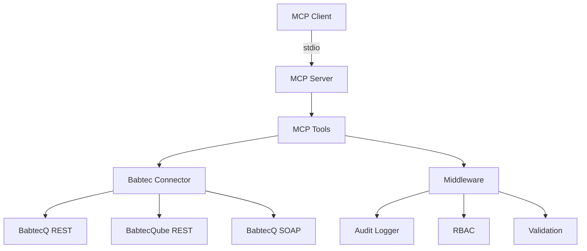

# Babtec MCP Server - Developer Guide

**Version:** 1.0.0  
**Last Updated:** 2025-01-27

## Table of Contents

1. [Introduction](#introduction)
2. [Project Structure](#project-structure)
3. [Architecture](#architecture)
4. [Development Setup](#development-setup)
5. [Code Organization](#code-organization)
6. [Adding New Tools](#adding-new-tools)
7. [Testing](#testing)
8. [Contributing](#contributing)
9. [Code Style](#code-style)
10. [Debugging](#debugging)

## Introduction

This guide helps developers understand the codebase, contribute improvements, and extend the server with new functionality.

### Technology Stack

- **Runtime**: Node.js 18+ (LTS)
- **Language**: TypeScript 5.0+
- **MCP SDK**: @modelcontextprotocol/sdk
- **HTTP Client**: axios
- **Validation**: zod
- **Logging**: winston
- **Testing**: vitest

### Key Principles

1. **Type Safety**: Full TypeScript coverage
2. **Modularity**: Clear separation of concerns
3. **Error Handling**: Comprehensive error handling
4. **Audit Compliance**: All operations logged
5. **Security**: RBAC enforced at tool level

## Project Structure

```
src/
  config/          # Configuration schema and loader
    schema.ts       # Zod schemas for configuration
    loader.ts       # Configuration loading logic
  connectors/       # Babtec API connectors
    babtec-connector.ts    # Main connector abstraction
    babtec-client.ts       # REST client implementation
    babtec-soap-client.ts  # SOAP client (if needed)
    circuit-breaker.ts     # Circuit breaker pattern
  middleware/       # Cross-cutting concerns
    audit.ts        # Audit logging
    audit-query.ts  # Audit log querying
    rbac.ts         # Role-based access control
    rate-limiter.ts # Rate limiting
    validation.ts   # Input validation
  server/          # MCP server implementation
    mcp-server.ts   # Main server class
    health-check.ts # Health checking
  tools/           # MCP tool implementations
    index.ts        # Tool registration
    inspection-plans.ts
    inspection-lots.ts
    complaints.ts
    actions.ts
    audits.ts
    health.ts
    audit-query.ts
  utils/           # Utilities
    errors.ts       # Error classes
    logger.ts       # Logging setup
    retry.ts        # Retry logic
  index.ts          # Application entry point
tests/
  integration/      # Integration tests
    babtec-connector.test.ts
    setup.ts
    test-data-manager.ts
```

## Architecture

### High-Level Architecture



### Component Responsibilities

**MCP Server:**
- Handles MCP protocol communication
- Manages tool registration
- Routes tool calls to handlers
- Handles errors and responses

**Tools:**
- Implement business logic for each MCP tool
- Validate inputs
- Call connectors
- Handle responses

**Connectors:**
- Abstract Babtec API differences
- Handle authentication
- Implement retry logic
- Manage circuit breakers

**Middleware:**
- Audit logging
- RBAC enforcement
- Input validation
- Rate limiting

## Development Setup

### Prerequisites

```bash
# Install Node.js 18+
node --version

# Install dependencies
npm install
```

### Development Mode

```bash
# Run in watch mode
npm run dev

# Build
npm run build

# Type check
npm run typecheck

# Lint
npm run lint

# Format
npm run format
```

### Environment Setup

Create `.env` file for local development:

```bash
BABTEC_ENDPOINT_URL=https://babtec-test.example.com/api
BABTEC_USERNAME=test-user
BABTEC_PASSWORD=test-password
LOG_LEVEL=debug
```

### IDE Setup

**VS Code:**
- Install TypeScript extension
- Install ESLint extension
- Install Prettier extension

**Recommended settings:**
```json
{
  "editor.formatOnSave": true,
  "editor.defaultFormatter": "esbenp.prettier-vscode",
  "typescript.tsdk": "node_modules/typescript/lib"
}
```

## Code Organization

### Module Structure

Each module follows this pattern:

```typescript
// 1. Imports
import { z } from 'zod';
import type { ToolHandler } from '../server/mcp-server.js';

// 2. Schema definitions
const myToolSchema = z.object({
  // ...
});

// 3. Tool factory function
export function createMyTools(
  connector: BabtecConnector,
  auditLogger: AuditLogger
): ToolHandler[] {
  return [
    {
      name: 'my_tool',
      description: 'Tool description',
      inputSchema: { /* ... */ },
      handler: async (args, context) => {
        // Implementation
      },
    },
  ];
}
```

### Error Handling

Use custom error classes:

```typescript
import { NotFoundError, ValidationError } from '../utils/errors.js';

// Throw specific errors
if (!entity) {
  throw new NotFoundError('Entity', id);
}

// Validation errors
if (!isValid(data)) {
  throw new ValidationError('Invalid data', details);
}
```

### Logging

Use the logger utility:

```typescript
import logger from '../utils/logger.js';

// Info level
logger.info('Operation completed', { entityId: id });

// Warning level
logger.warn('Potential issue', { details });

// Error level
logger.error('Operation failed', { error, context });

// Debug level
logger.debug('Detailed information', { data });
```

## Adding New Tools

### Step 1: Create Tool File

Create a new file in `src/tools/`:

```typescript
// src/tools/my-feature.ts
import { z } from 'zod';
import type { ToolHandler } from '../server/mcp-server.js';
import { BabtecConnector } from '../connectors/babtec-connector.js';
import { validateInput } from '../middleware/validation.js';
import { requirePermission } from '../middleware/rbac.js';
import { AuditLogger } from '../middleware/audit.js';

const myToolSchema = z.object({
  id: z.string(),
  // ... other fields
});

export function createMyFeatureTools(
  connector: BabtecConnector,
  auditLogger: AuditLogger
): ToolHandler[] {
  return [
    {
      name: 'babtec_my_tool',
      description: 'Description of what this tool does',
      inputSchema: {
        type: 'object',
        properties: {
          id: { type: 'string', description: 'Entity ID' },
        },
        required: ['id'],
      },
      handler: async (args, context) => {
        // Check permissions
        requirePermission('read:myfeature')(context);
        
        // Validate input
        const params = validateInput(myToolSchema, args);
        
        // Get client
        const client = connector.getClient();
        
        // Call API
        const result = await client.get(`/api/myfeature/${params.id}`);
        
        // Log read operation
        await auditLogger.logReadOperation(
          'babtec_my_tool',
          context,
          'myfeature',
          params.id
        );
        
        // Return result
        return result;
      },
    },
  ];
}
```

### Step 2: Register Tools

Add to `src/tools/index.ts`:

```typescript
import { createMyFeatureTools } from './my-feature.js';

export function registerAllTools(
  // ... existing parameters
): void {
  const allTools: ToolHandler[] = [
    // ... existing tools
    ...createMyFeatureTools(connector, auditLogger),
  ];
  
  // ... rest of registration
}
```

### Step 3: Add Tests

Create test file:

```typescript
// tests/my-feature.test.ts
import { describe, it, expect, vi } from 'vitest';
import { createMyFeatureTools } from '../src/tools/my-feature.js';

describe('My Feature Tools', () => {
  it('should create tool with correct schema', () => {
    const tools = createMyFeatureTools(mockConnector, mockAuditLogger);
    expect(tools).toHaveLength(1);
    expect(tools[0].name).toBe('babtec_my_tool');
  });
  
  // ... more tests
});
```

### Step 4: Update Documentation

Update:
- `docs/API.md` - Add tool documentation
- `docs/USER-MANUAL.md` - Add usage examples
- `README.md` - Update tool count if needed

## Testing

### Unit Tests

```bash
# Run unit tests
npm test

# Run with coverage
npm run test:coverage

# Watch mode
npm test -- --watch
```

### Integration Tests

```bash
# Run integration tests (requires Babtec test environment)
npm run test:integration
```

### Test Structure

```typescript
import { describe, it, expect, beforeEach, vi } from 'vitest';

describe('Feature Name', () => {
  beforeEach(() => {
    // Setup
  });
  
  it('should do something', () => {
    // Arrange
    const input = { /* ... */ };
    
    // Act
    const result = functionUnderTest(input);
    
    // Assert
    expect(result).toEqual(expected);
  });
});
```

### Mocking

```typescript
import { vi } from 'vitest';

// Mock connector
const mockConnector = {
  getClient: vi.fn(() => ({
    get: vi.fn().mockResolvedValue({ data: 'test' }),
  })),
} as unknown as BabtecConnector;
```

## Contributing

### Development Workflow

1. **Create branch**: `git checkout -b feature/my-feature`
2. **Make changes**: Implement feature
3. **Add tests**: Write tests for new code
4. **Run tests**: Ensure all tests pass
5. **Lint and format**: Fix any issues
6. **Commit**: Use conventional commits
7. **Push**: Push to remote
8. **Create PR**: Create pull request

### Commit Messages

Use conventional commits:

```
feat: add new tool for feature X
fix: resolve issue with Y
docs: update user manual
test: add tests for Z
refactor: improve code structure
```

### Pull Request Checklist

- [ ] Code follows style guide
- [ ] Tests added/updated
- [ ] All tests pass
- [ ] Documentation updated
- [ ] No linting errors
- [ ] Type checking passes

## Code Style

### TypeScript

- Use strict mode
- Prefer interfaces for object shapes
- Use type aliases for unions
- Avoid `any` - use `unknown` if needed

### Naming Conventions

- **Files**: kebab-case (`my-feature.ts`)
- **Classes**: PascalCase (`BabtecConnector`)
- **Functions**: camelCase (`createTools`)
- **Constants**: UPPER_SNAKE_CASE (`MAX_RETRIES`)
- **Types/Interfaces**: PascalCase (`ToolHandler`)

### Formatting

Use Prettier (configured in `.prettierrc.json`):

```bash
npm run format
```

### ESLint

Follow ESLint rules (configured in `.eslintrc.json`):

```bash
npm run lint
npm run lint:fix
```

## Debugging

### Debug Mode

Set log level to debug:

```bash
export LOG_LEVEL=debug
npm run dev
```

### VS Code Debugging

Create `.vscode/launch.json`:

```json
{
  "version": "0.2.0",
  "configurations": [
    {
      "type": "node",
      "request": "launch",
      "name": "Debug MCP Server",
      "program": "${workspaceFolder}/src/index.ts",
      "runtimeExecutable": "tsx",
      "env": {
        "LOG_LEVEL": "debug"
      }
    }
  ]
}
```

### Common Issues

**Type errors:**
- Run `npm run typecheck` to see all errors
- Check imports are correct
- Verify types are exported

**Runtime errors:**
- Check logs for error details
- Verify configuration
- Check network connectivity

**Test failures:**
- Run tests individually
- Check mock setup
- Verify test data

---

**Additional Resources:**
- [Architecture Documentation](ARCHITECTURE.md)
- [API Documentation](API.md)
- [Configuration Reference](CONFIGURATION-REFERENCE.md)
